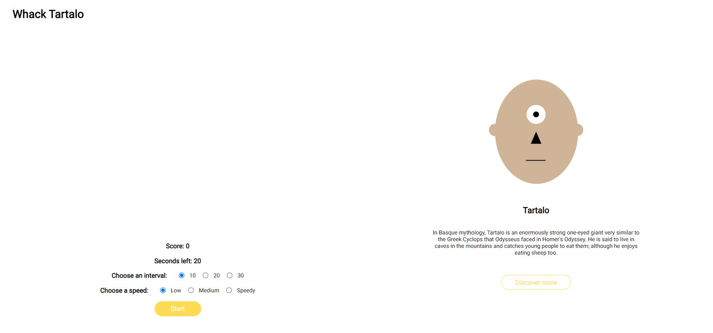

# Whack Tartalo

## How It Works

Let's play! The game is based on the famous **Whack a mole** game, but with customized aesthetics inspired in Basque Mythology and one of its most representative figures: **Tartalo**. If you are not familiar with the game, the rules are very simple; you must hit as many moles, in this case Tartalos, as you can before the timer runs out. 

Rules and settings:

* You can choose the number of **seconds** for the game (between 10 and 30)
* You can also set your preferred **speed** (low, medium or speedy)
* Once you have chosen the settings, you can start the game by clicking in the **Start** button below
* The timer decreases by 1s once you have clicked the button
* Each Tartalo you whack is worth 1 point
* At the end of the game, a pop up will appear with your final result

You will find the **score** beneath the board, as well as the number of seconds left.

You can reset the game by clicking in **Try again** and start over with the previous or new settings

## What I've practiced

* querySelector()
* addEventListener()
* setInterval()
* classList
* forEach()
* Arrow functions
* Advanced DOM
* Transitions

## Web Application

You will find below some images of each state of the application, as well as some additional information:

*With:*
*- The game board*
*- A score result*
*- A time counter*
*- Radio inputs to select the time*
*- Radio inputs to select the speed*
*- A start button*
*- An article with information about Tartalo*
*- A link to learn more about him*

Once you click the start button, Tartalo will appear randomly in the board game, and his aspect will change when hovering and whacking him: 

When there are no more seconds left, a pop up will appear with your final result. The site will return to its initial state when clicking in try again and you will be able to start a new game:

## Credits

* [learn-javascript-by-building-games](https://www.freecodecamp.org/news/learn-javascript-by-building-7-games-video-course/)

